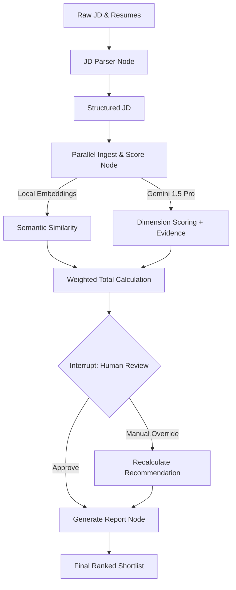

# HR Resume & LinkedIn Shortlisting Agent

An advanced, AI-powered recruitment agent designed to streamline the candidate shortlisting process using hybrid semantic matching and structured LLM reasoning.

## 🚀 Project Overview

This prototype leverages **LangChain**, **LangGraph**, and **Local Embeddings** to evaluate resumes and LinkedIn profiles against specific Job Descriptions (JD). It implements a multi-stage pipeline:
1.  **JD Parsing**: Extracting structured requirements from raw text.
2.  **Hybrid Ingestion**: Processing PDF, DOCX, and JSON profiles.
3.  **Semantic Matching**: Using local Sentence-Transformers for fast, private similarity checks.
4.  **Structured Scoring**: Applying a weighted 5-dimension rubric using Gemini 1.5 Pro.
5.  **Human-in-the-Loop**: Allowing recruiters to override and log scoring adjustments.

### Agent Architecture



## 🛠️ Setup & Installation

### Prerequisites
- Python 3.9+
- Google Cloud API Key (for Gemini 1.5 Pro)
- LangSmith API Key (for observability)

### Installation
1.  **Clone the repository**:
    ```bash
    git clone <repository-url>
    cd hr_agent
    ```
2.  **Install dependencies**:
    ```bash
    pip install -r requirements.txt
    ```
3.  **Configure Environment**:
    Create a `.env` file in the root directory:
    ```env
    GOOGLE_API_KEY=your_gemini_api_key_here
    LANGCHAIN_TRACING_V2=true
    LANGCHAIN_API_KEY=your_langsmith_key_here
    ```

## 🧠 Technical Disclosures

### Large Language Model (LLM)
- **Chosen Model**: `gemini-1.5-pro`
- **Justification**: Gemini 1.5 Pro provides a massive context window and superior structured output capabilities. We leverage its long-context reasoning to extract direct "Evidence Quotes" from resumes.

### Agent Framework
- **Framework**: `LangGraph`
- **Justification**: Enables cyclic workflows and mandatory Human-in-the-Loop interrupts. The workflow is refactored for **Parallel Execution**, processing multiple candidates concurrently to minimize latency.

### Production Observability
- **Tool**: `LangSmith`
- **Justification**: Integrated for full-lifecycle tracing, debugging, and performance monitoring. Every candidate evaluation is logged and auditable in the LangSmith dashboard.

## 🛡️ Security Risk Mitigation

### 1. Prompt Injection
- **Mitigation**: We utilize **Structured Output (Pydantic)**. By forcing the LLM to adhere to a strict schema with validators, we prevent adversarial prompt leakage into the application logic.

### 2. Hallucination Risk
- **Mitigation**: **Evidence-Based Reasoning**. The agent is forced to extract `evidence_quotes` directly from the resume source. If the quotes don't match the score, the hallucination is immediately visible to the human reviewer.

### 3. Fail-Safe Ingestion
- **Mitigation**: Robust error handling for malformed or encrypted PDFs. Unparseable files are flagged with `STATUS: UNPARSEABLE` and bypassed in the scoring pipeline, preventing LLM noise.
